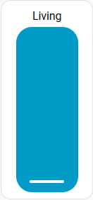
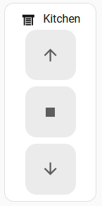
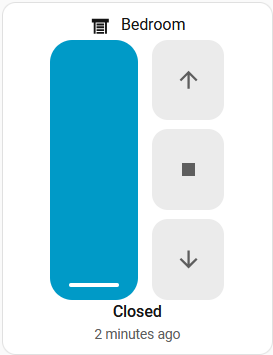

# Vertical Slider Card

A custom Home Assistant Lovelace card that provides a vertical slider for cover entities (blinds, awnings, shutters) — replicating the native HA cover popup slider as a standalone dashboard card.

## Examples

<table>
  <tr>
    <td align="center"><b>Minimal</b><br>Slider only</td>
    <td align="center"><b>Buttons only</b><br>No slider</td>
    <td align="center"><b>Full</b><br>Slider + Buttons + Status</td>
  </tr>
  <tr>
    <td></td>
    <td></td>
    <td></td>
  </tr>
  <tr>
    <td>

```yaml
type: custom:vertical-slider-card
entity: cover.living_room
name: Living
hide_icon: true
hide_state: true
features:
  - type: cover-position
```

</td>
    <td>

```yaml
type: custom:vertical-slider-card
entity: cover.kitchen
features:
  - type: cover-open-close
```

</td>
    <td>

```yaml
type: custom:vertical-slider-card
entity: cover.bedroom
features:
  - type: cover-position
  - type: cover-open-close
```

</td>
  </tr>
</table>

## Features

- Vertical slider matching the native HA cover popup behavior
- Drag to set target position, tracks real entity state after release
- Full HA theme support — all colors derived from the active dashboard theme
- Open / Close / Stop buttons beside the slider
- Toggle slider and buttons independently via features
- Hide icon and/or state for compact layouts
- Responsive tooltip (auto-positions left or right based on space)
- Visual card editor
- Localization follows HA language setting
- HACS compatible

## Installation

### HACS (recommended)

1. Open HACS in your Home Assistant instance
2. Go to **Frontend** > **Custom repositories**
3. Add `https://github.com/L3t4l3s/vertical_slider_card` as a **Dashboard** repository
4. Install **Vertical Slider Card**
5. Restart Home Assistant

### Manual

1. Download `vertical-slider-card.js` from the [latest release](https://github.com/L3t4l3s/vertical_slider_card/releases/latest)
2. Copy it to your `config/www/` folder
3. Add the resource in **Settings > Dashboards > Resources**:
   - URL: `/local/vertical-slider-card.js`
   - Type: JavaScript Module

## Configuration

### Options

| Option | Type | Default | Description |
|---|---|---|---|
| `entity` | string | **required** | Cover entity ID |
| `name` | string | Entity name | Override display name |
| `icon` | string | Entity icon | Override icon |
| `color` | string | Theme color | Color token (e.g. `purple`, `blue`) |
| `hide_icon` | boolean | `false` | Hide the icon in the header |
| `hide_state` | boolean | `false` | Hide state and last-changed |
| `tap_action` | action | `more-info` | Tap action on card body |
| `hold_action` | action | `none` | Hold action |
| `double_tap_action` | action | `none` | Double tap action |
| `features` | list | `[]` | Feature controls (see below) |

### Features

| Type | Description |
|---|---|
| `cover-position` | Show the vertical position slider |
| `cover-open-close` | Open / Stop / Close buttons beside the slider |

Without any features, the card shows just the header and footer. Add `cover-position` for the slider, `cover-open-close` for the buttons, or both.

## Development

```bash
npm install
npm run build        # Production build
npm run watch        # Development with file watching
npm start            # Dev server on port 5000
```

## License

MIT
